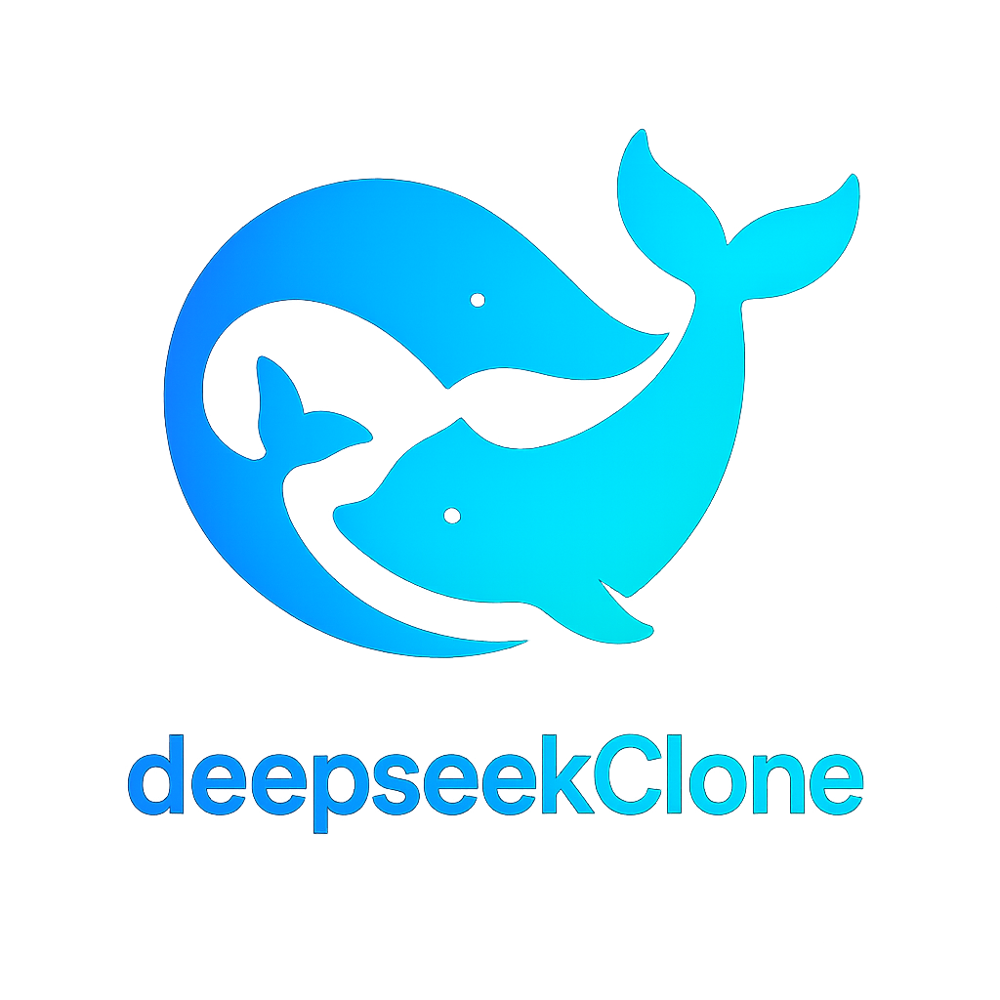
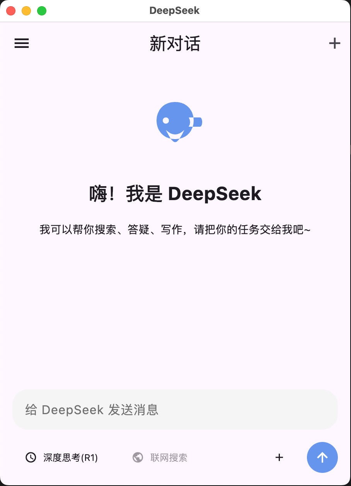
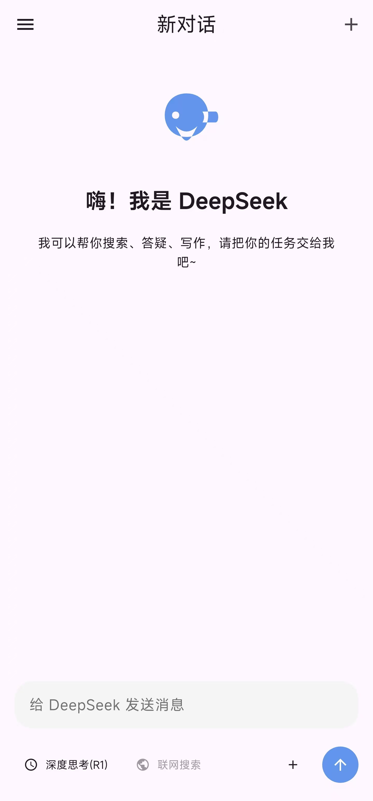
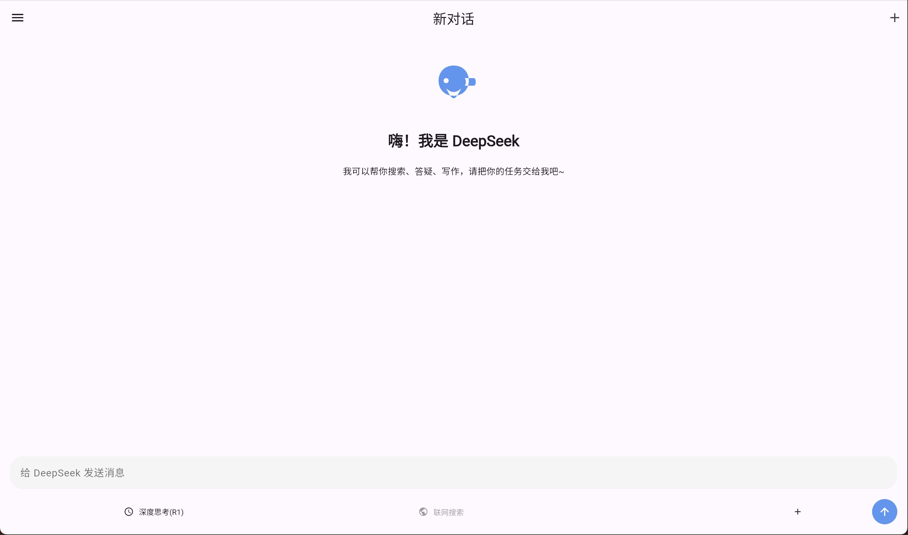

# deepseekClone

  
  <h3>An unofficial deepseek Flutter client</h3>
  
Get intelligent answers anytime, anywhere to improve productivity and solve problems.

  <a href="#features">Features</a> •
  <a href="#screenshots">Screenshots</a> •
  <a href="#installation">Installation</a> •
  <a href="#development">Development</a> •
  <a href="#technologies">Technologies</a> •
  <a href="#contributing">Contributing</a> •
  <a href="#license">License</a>

## Features

deepseekClone is an unofficial deepseek Flutter client, developed with the Flutter framework to provide a smooth cross-platform experience. Whether for work, study, or daily life, it's here to help.

- **Fast Response**: Second-level responses, no waiting, get the information you need instantly
- **Multi-language Support**: Supports multiple languages including English, Chinese, and more
- **Multi-platform Compatibility**: Developed with Flutter, supports Web, macOS, Windows, Android, and iOS
- **Intelligent Understanding**: Connects to deepseek's natural language processing capabilities
- **Offline Use**: Supports offline mode for use without an internet connection
- **Data Security**: Strict data encryption and privacy protection measures
- **Open Source**: Completely open source, welcoming community contributions and improvements
- **Customizable Interface**: Customize the interface and features according to your needs

## Screenshots

  
  
<em>Desktop Application</em>

  
  
<em>Mobile Application</em>

  
  
  
<em>Web Application</em>

## Installation

### Prerequisites

- Flutter SDK (latest stable version)
- Dart SDK (latest stable version)
- Android Studio / Xcode (for mobile development)
- Visual Studio Code (recommended)

### Setup

1. Clone the repository:

\`\`\`bash
git clone https://github.com/fakingai/deepseek-clone.git
cd deepseek-clone
\`\`\`

2. Install dependencies:

\`\`\`bash
flutter pub get
\`\`\`

3. Run the application:

\`\`\`bash
# For web
flutter run -d chrome

# For desktop
flutter run -d macos  # or windows/linux

# For mobile
flutter run -d android  # or ios
\`\`\`

### Download Prebuilt Binaries

You can download the latest prebuilt binaries for your platform:

- [Windows](https://github.com/fakingai/deepseek-clone/releases/latest/download/DeepSeek-Windows.exe)
- [macOS](https://github.com/fakingai/deepseek-clone/releases/latest/download/DeepSeek-macOS.dmg)
- [Android](https://github.com/fakingai/deepseek-clone/releases/latest/download/DeepSeek-Android.apk)
- iOS: Available via TestFlight (scan QR code on the website)
- [Web Version](https://deepseek-web.fakingai.com)

## Development

### Project Structure

\`\`\`
deepseekClone/
├── lib/                  # Source code
│   ├── api/              # API services
│   ├── models/           # Data models
│   ├── screens/          # UI screens
│   ├── widgets/          # Reusable widgets
│   ├── utils/            # Utility functions
│   ├── constants/        # Constants and configurations
│   └── main.dart         # Entry point
├── assets/               # Static assets
├── test/                 # Test files
├── web/                  # Web-specific files
├── android/              # Android-specific files
├── ios/                  # iOS-specific files
├── macos/                # macOS-specific files
├── windows/              # Windows-specific files
└── pubspec.yaml          # Dependencies
\`\`\`

### Environment Variables

Create a `.env` file in the root directory with the following variables:

\`\`\`
API_KEY=your_deepseek_api_key
API_URL=https://api.deepseek.com
\`\`\`

## Technologies

- [Flutter](https://flutter.dev/) - UI framework
- [Dart](https://dart.dev/) - Programming language
- [Provider](https://pub.dev/packages/provider) - State management
- [Dio](https://pub.dev/packages/dio) - HTTP client
- [Hive](https://pub.dev/packages/hive) - Local database
- [Flutter Hooks](https://pub.dev/packages/flutter_hooks) - Stateful logic reuse
- [GetX](https://pub.dev/packages/get) - Navigation and dependency injection
- [Flutter Localizations](https://pub.dev/packages/flutter_localizations) - Internationalization

## Contributing

We welcome contributions to deepseekClone! Here's how you can help:

1. Fork the repository
2. Create your feature branch (`git checkout -b feature/amazing-feature`)
3. Commit your changes (`git commit -m 'Add some amazing feature'`)
4. Push to the branch (`git push origin feature/amazing-feature`)
5. Open a Pull Request

Please read our [Contributing Guidelines](CONTRIBUTING.md) for more details.

## License

This project is licensed under the MIT License - see the [LICENSE](LICENSE) file for details.

## Disclaimer

deepseekClone is an unofficial third-party client and is not affiliated with, endorsed by, or connected to deepseek in any way. This is a community-driven project.

## Contact

- GitHub: [https://github.com/lifecoder1988](https://github.com/lifecoder1988)

---

  
Made with ❤️ by the deepseekClone community

